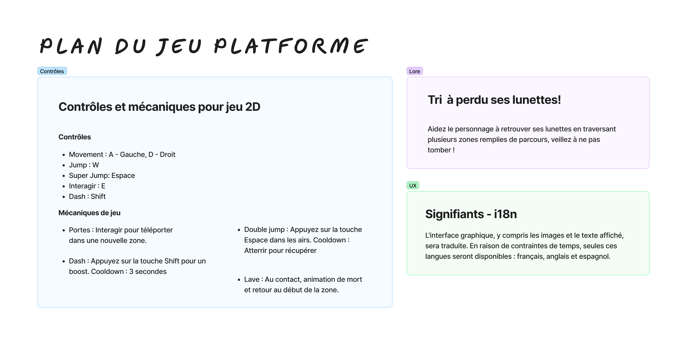
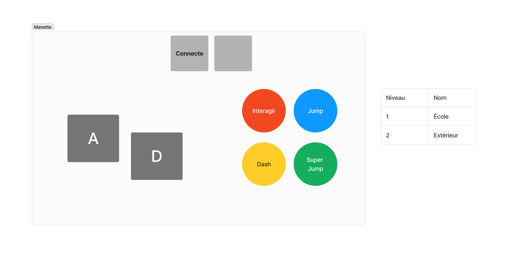
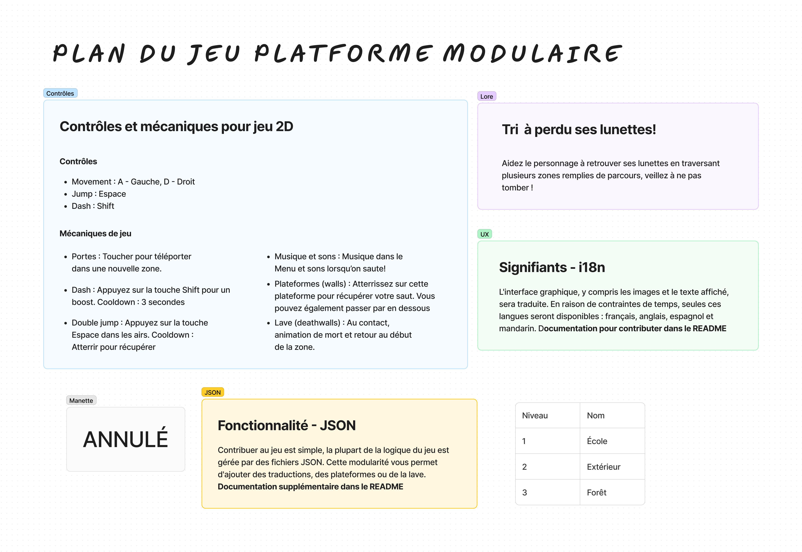

# interface-Jeu
_En cadre avec le cours d'interfaces humain machines pour **Création d'un jeu avec objet(s) connecté(s)**_

## Plans initales




## Plan finale


## Jouer au jeu
Pour installer et jouer au jeu, veuillez...
- Installer avec `git clone https://github.com/hodux/interface-Jeu.git`
- Ouvrir le dossier interface-Jeu dans Visual Studio
- Ouvrir `Menu.html` avec [Live Server](https://marketplace.visualstudio.com/items?itemName=ritwickdey.LiveServer)
> [!CAUTION]
> Le jeu n'est pas RWD, il DOIT être jouer sur un écran de 1920x1080 en fullscreen (utiliser F11) pour empêcher les erreurs. Ceci est affiché dans les règles, vous ne pourrez pas jouer au jeu sans le faire.

## Comment contribuer
#### La modularité du jeu permet à des individus qui souhaitent contribuer au jeu d'ajouter des traductions ou des niveaux.
> [!NOTE]
> Les traductions pour le jeu sont présent dans [translations.json](https://github.com/hodux/interface-Jeu/blob/main/json/translations.json), les plateformes (walls) et la lave (deathwalls) pour les niveaux sont dans le [même dossier json.](https://github.com/hodux/interface-Jeu/blob/main/json)

#### Pour ajouter une traduction :
- Inscrivez le code ISO 639-1 comme identifiant.
- Assurez-vous que les keys restent les mêmes.

Exemple traduction français :
```json
"fr": {
  "welcome": "Bienvenue dans l'aventure de Tri",
  "rules": "Règles",
  "start": "Démarrer",
  "title": "Règles de l'aventure de Tri",
  "controls": "- Contrôles -",
  "moveLeft": "A pour aller à gauche, D pour aller à droite",
  "jump": "Sauter: Espace",
  "doubleJump": "Espace x2 pour double saut",
  "dash": "Maj: Dash",
  "lore": "Dirigez-vous vers les portes pour avancer vers les étapes suivantes à la recherche des lunettes de Tri. Soyez prudent car certaines plates-formes présentent des risques mortels; par conséquent, éviter les!",
  "info": "Pour une expérience optimale, jouez en mode plein écran avec une résolution de 1920x1080 en utilisant la touche F11",
  "back": "Retourner au menu",
  "victory": "Félicitations!",
  "found": "Vous avez trouvé les lunettes de Tri !",
  "button": "Retour au menu",
  "deathMessage": "Vous êtes mort",
  "restart": "Recommencer",
  "mainMenu": "Retour au menu principal"
},
```

#### Pour ajouter un niveau :
- Créer deux nouveaux fichier pour le niveau, `level?_walls.json` et `level?_deathwalls.json`
- Les plateformes et la lave sont définies par leur position, taille, couleur et vitesse verticale.

Exemple avec trois plateformes :
```json
[
    {"x": 0, "y": 700, "width": 300, "height": 50, "color": "orange", "speed": 0},
    {"x": 500, "y": 700, "width": 300, "height": 50, "color": "orange", "speed": 0},
    {"x": 1400, "y": 700, "width": 300, "height": 50, "color": "orange", "speed": 0} 
]
```

## Problèmes, fonctionnalitées souhaitées
- Pour les alertes, j'ai voulu utilisé le fichier json pour les traduires, mais un bug m'empêchait. (Mathieu)
- Je crois que coder toutes les plateformes dans un seul fichier json serait mieux, plutôt que les séparer comme j'ai fais. (Mathieu)
